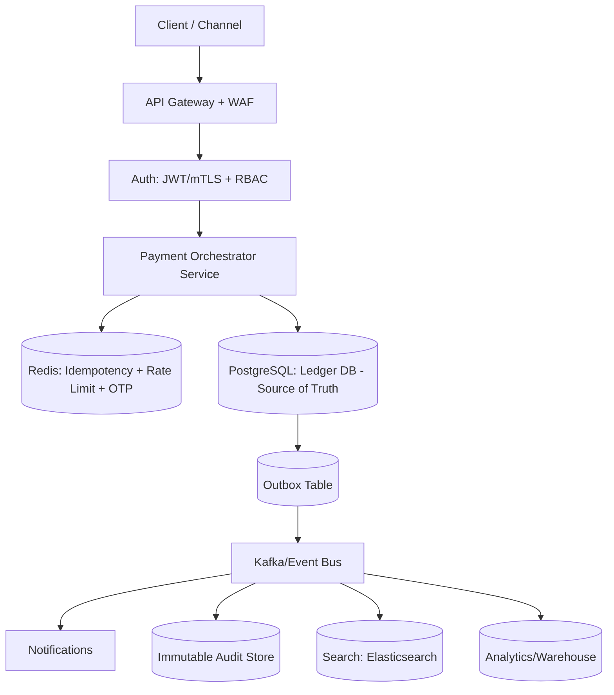
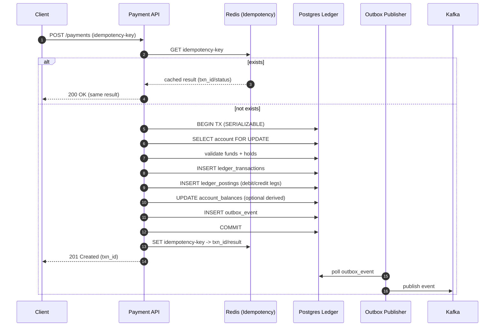

---

## 1) 45 BFSI Database Interview Questions With Model Answers

### A) Ledger correctness, isolation, concurrency (1–12)

**1) Why do banks prefer SQL (Postgres/SQL Server) for core ledger?**
Because ledger needs **ACID + constraints + deterministic transactions**. Eventual consistency can produce incorrect balances and audit gaps.

**2) What isolation level is safest for posting money movement?**
**SERIALIZABLE** (or at least **REPEATABLE READ** with careful locking). For “same account concurrent debit”, SERIALIZABLE prevents write skew/phantoms.

**3) How do you prevent double-debit when two requests hit same account?**

* **Idempotency key** per request
* **Single DB transaction**: lock account row (`SELECT ... FOR UPDATE`)
* Validate available balance
* Insert postings (debit/credit)
* Commit atomically

**4) Where do you place the balance check?**
**Inside the same transaction** that writes postings. Never “check then write” across multiple transactions.

**5) How do you avoid lost updates on balances?**
Don’t store balance as a single mutable number only. Prefer **append-only postings** + computed balance, or maintain a balance table updated under lock using atomic update.

**6) Should you store “balance” or compute it from entries?**
Best practice in banking:

* **Source of truth** = **journal/postings** (append-only)
* “Balance” table = **derived / cached** for performance (rebuildable)

**7) How do you handle insufficient funds safely?**
Within transaction (with lock): compute available funds (balance - holds), reject if negative; write a rejection audit entry.

**8) How do you design for exactly-once posting?**
Use:

* **Idempotency table** with unique constraint on `(tenant_id, idempotency_key)`
* On retry: return stored result without re-posting

**9) What is write skew and why it matters?**
Two transactions read the same state and both pass constraints, then both write — resulting in invalid combined state. SERIALIZABLE prevents it.

**10) How do you handle reversals/chargebacks?**
Never delete/overwrite postings. Create a **reversal transaction** that posts opposite entries, linked to original transaction_id.

**11) How do you represent fees and FX?**
As separate postings/legs under the same transaction:

* Debit customer
* Credit merchant
* Credit fee income
* FX legs if needed with rate snapshot

**12) How do you ensure “debit = credit” always?**
Enforce at DB layer via:

* Transaction-level invariant: sum(debits) == sum(credits)
* Validate before commit; optionally enforce via stored procedure or constraint patterns.

---

### B) Auditability, compliance, immutability (13–22)

**13) What makes a database “audit-ready” in BFSI?**

* Append-only financial events
* Full traceability: who/what/when/why
* Immutable audit log (no updates/deletes)
* Strong access controls + least privilege
* Time-based retention + legal hold support

**14) How do you implement immutable audit logs?**

* Separate `audit_log` table append-only
* No update/delete permissions for app role
* Row-level security (RLS) for tenancy
* Optional hash-chaining: store `prev_hash`, `hash`

**15) What’s maker-checker in DB terms?**
Two-step authorization:

* Maker creates a pending transaction/request
* Checker approves → triggers actual posting transaction
  DB stores status transitions with approver identity & timestamps.

**16) Soft delete vs hard delete in BFSI?**
Ledger-related data should **never hard delete**. Use soft delete only for non-financial entities; for financial records use **reversal/correction entries**.

**17) How do you meet data retention (7–10 years) and still keep performance?**
Partition by time; keep recent partitions “hot”; archive old partitions to cheaper storage while preserving retrieval ability.

**18) How do you support regulator queries?**
Maintain:

* Queryable historical partitions
* Materialized views for statements
* Immutable audit trails
* Export pipelines with tamper evidence

**19) What encryption is expected?**

* TLS in transit
* Encryption at rest (TDE / managed)
* Column-level encryption/tokenization for PII
* KMS-managed keys with rotation

**20) How to avoid PII leakage in logs?**

* Never log raw identifiers/PII
* Masking/hashing
* Separate secure audit logs with strict access

**21) How do you prove integrity of ledger records?**

* Append-only postings + immutability controls
* Hash-chaining of audit rows
* Signed events (optional)
* Periodic reconciliation jobs

**22) What is “reconciliation” in DB terms?**
Comparing independent sources:

* ledger vs payment network reports
* ledger vs settlement files
* ensuring totals match; discrepancies stored as cases.

---

### C) Scaling, performance, partitioning, replication (23–34)

**23) How do you scale reads for statements and dashboards?**

* Read replicas
* CQRS read model
* Materialized views
* Partition pruning
* Caching frequently accessed results

**24) How do you handle write scaling for ledger?**
Ledger is often **write-hot and correctness-heavy**, so:

* scale vertically + tuned IO
* partition by time / tenant / account bucket
* keep transactions short
* offload non-critical writes via outbox/events

**25) When would you shard a banking DB?**
When a single primary cannot meet throughput/size even after partitioning and vertical scaling. Shard by **account_id hash / tenant_id** with strict routing.

**26) What is “hot partition” and how do you mitigate?**
A few accounts/tenants generate most traffic. Mitigate with:

* smarter partition key (hash bucket)
* queueing/throttling per account
* dedicated shards for whales

**27) Best indexing practices for BFSI tables?**

* Composite indexes matching query filters
* Avoid too many indexes on heavy-write tables
* Use partial indexes (e.g., status='PENDING')
* Monitor bloat; vacuum/analyze

**28) How do you optimize transaction history queries?**

* Time partitioning
* Covering indexes `(account_id, posted_at DESC)`
* Statement materialized view per account per month

**29) What connection pooling strategy?**

* PgBouncer / DB proxy
* App pool sized to DB capacity
* Separate pools for read vs write
* Serverless: MUST use proxy/pooler

**30) How do you manage replication lag impact?**

* For consistency-critical reads, read primary
* For statements/dashboards, tolerate lag
* Expose “as-of timestamp” to client for transparency

**31) Vertical vs horizontal scaling in BFSI DBs?**

* Ledger typically scales **up first** (vertical) to preserve transactional integrity
* Scale out via read replicas + partitioning
* Sharding is last resort due to complexity

**32) What’s your archiving strategy?**

* Partition detach old data
* Move to cold store (object storage)
* Keep metadata indexes for retrieval
* Restore on demand for disputes/regulator queries

**33) TTL strategies in BFSI?**
TTL is common for:

* sessions
* OTPs
* rate-limit counters
  Not for ledger. Ledger uses retention rules, not TTL deletion.

**34) Materialized views in BFSI?**
Use for:

* account statements
* daily totals
* risk dashboards
  Refresh async (incremental if possible) and track refresh time.

---

### D) Distributed systems, events, outbox, CQRS, DR (35–45)

**35) How do you avoid distributed transactions across microservices?**
Avoid 2PC. Use:

* **Saga pattern** (orchestration/compensation)
* **Outbox pattern** for reliable event publish

**36) Explain the outbox pattern in one sentence.**
Write business data + an `outbox_event` row in the same DB transaction, then a publisher reliably streams it to Kafka/RabbitMQ.

**37) Why is outbox important in BFSI?**
Prevents “ledger updated but event not sent” or “event sent but ledger not committed” — a major audit/compliance risk.

**38) When do you use CQRS in banking?**
When reads are heavy and diverse (search, dashboards, fraud analytics) while writes must remain strict and transactional.

**39) Event sourcing vs ledger postings — are they same?**
They’re related: ledger postings are already append-only events. Event sourcing extends this to store **all state changes** as events for rebuildability.

**40) How do you ensure idempotency across message consumers?**
Consumer writes with a unique constraint on `(consumer_name, event_id)`; if duplicate delivery occurs, DB rejects duplicates safely.

**41) What are RPO and RTO targets and how DB design supports them?**

* **RPO=0** needs synchronous replication (limited distance)
* **RTO** needs automated failover + tested runbooks
  Ledger often targets very low RPO, strict RTO.

**42) Active-active vs active-passive for ledger: which and why?**
Ledger usually **active-passive** because active-active introduces conflict/double-spend risk and complex global ordering.

**43) If management demands active-active, what constraints do you impose?**

* Single-writer per account (account ownership routing)
* Global unique txn ids
* Deterministic conflict resolution
* Strong reconciliation & monitoring

**44) How do you design tamper-evident ledger exports?**

* Export batches with checksum/hashes
* Store batch hash in audit table
* Sign with key (optional)
* Provide traceable lineage

**45) What’s the best “banking-grade” DB answer in interviews?**
“**PostgreSQL for ledger (ACID), Redis for idempotency/cache, Kafka + outbox for reliable async, read replicas/CQRS for statements, partitions for history, and immutable audit trails**.”

---

## 2) Detailed Payment DB Schema (Banking-grade)

This is a practical schema you can explain in interviews. It supports:

* idempotency
* maker-checker
* double-entry ledger
* outbox events
* audit

### Core tables (high level)

* `customers`
* `accounts` (customer accounts)
* `merchants` (if acquiring/merchant payments)
* `payment_requests` (API-level intent + idempotency)
* `ledger_transactions` (journal header)
* `ledger_postings` (journal lines: debit/credit)
* `account_balances` (derived/cache)
* `holds` (authorization holds)
* `outbox_events`
* `audit_log`
* `approvals` (maker-checker)

---

## 3) Ledger Table Design (Double-Entry)

### A) `ledger_transactions` (Journal header)

Key design points:

* One business transaction = one journal header
* Contains metadata, correlation ids, status

**Fields (suggested)**

* `txn_id` (UUID, PK)
* `tenant_id`
* `txn_type` (CARD_AUTH, TRANSFER, REFUND, FEE, FX, SETTLEMENT…)
* `status` (PENDING/POSTED/REVERSED/FAILED)
* `request_id` / `idempotency_key`
* `external_ref` (bank/network reference)
* `created_at`, `posted_at`
* `created_by`, `approved_by` (if maker-checker)
* `currency`
* `description`
* `reversal_of_txn_id` (nullable)

### B) `ledger_postings` (Journal lines)

This is the money truth.

**Fields (suggested)**

* `posting_id` (UUID, PK)
* `txn_id` (FK -> ledger_transactions)
* `tenant_id`
* `account_id` (FK -> accounts)
* `entry_type` (DEBIT/CREDIT)
* `amount_minor` (BIGINT) — store in minor units (paise/fils/cents)
* `currency`
* `posted_at`
* `running_balance_minor` (optional; if you store snapshots)
* `narration`
* Index: `(account_id, posted_at DESC)` and `(txn_id)`

**Invariant**

* Sum(DEBIT) == Sum(CREDIT) per txn_id

### C) `account_balances` (Derived, cached)

* `account_id` PK
* `available_minor`
* `ledger_minor`
* `updated_at`
  Updated under lock, rebuildable from postings.

### D) Idempotency

`payment_requests`

* unique `(tenant_id, idempotency_key)`
* stores `result_txn_id` once completed

---

## 4) High-Level Architecture Diagram (BFSI DB-centric)

---

## 5) Low-Level Payment Posting Flow Diagram (DB correctness)

---

## 6) How to Talk About This in Interviews (1-minute “banking DB pitch”)

> “For BFSI, the ledger must be an ACID source of truth, so I model it as a double-entry system: journal header + postings lines stored append-only. I enforce idempotency with unique keys, avoid distributed transactions by using the outbox pattern, and scale reads via replicas/CQRS/materialized views. For multi-region, I keep ledger active-passive with strict RPO/RTO, and for compliance I maintain immutable audit logs with traceability and encryption.”

---

## If you want (still only BFSI DB prep), I can add next

* A **ready-to-use Postgres DDL** for these tables (constraints + indexes)
* A **query pack**: “statement query”, “daily totals”, “reconciliation query”, “fraud counters”
* “Top 10 failure modes” (replication lag, deadlocks, hot accounts) + mitigation
