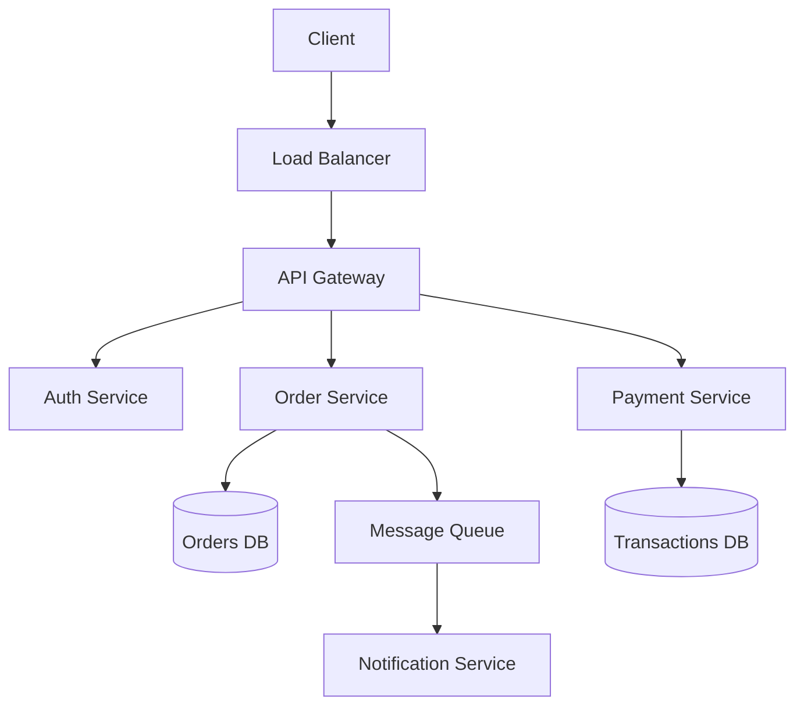
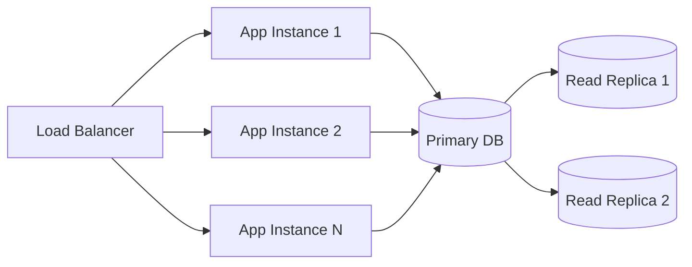

# 🔍 HLD (High-Level Design) Concepts: The Complete Guide

High-Level Design is about the **big picture**—architecture, components, data flow, and system interactions without diving into implementation details. Here's a comprehensive breakdown specifically for Node.js/NestJS developers targeting BFSI, e-commerce, healthcare, and iGaming domains.

---

## 📊 HLD vs LLD: The Difference

| Aspect | High-Level Design (HLD) | Low-Level Design (LLD) |
| :--- | :--- | :--- |
| **Scope** | System architecture, modules, data flow | Class diagrams, methods, algorithms |
| **Audience** | Architects, Tech Leads, Stakeholders | Developers implementing features |
| **Components** | Services, databases, queues, caches | Classes, interfaces, functions |
| **Decisions** | Tech stack, partitioning, replication | Design patterns, data structures |
| **Output** | Architecture diagrams, component models | UML diagrams, pseudocode |

---

## 🏗️ Core HLD Components

### 1. System Architecture Styles

| Architecture | Description | Use Case | Node.js Implementation |
| :--- | :--- | :--- | :--- |
| **Layered (n-tier)** | Presentation, Business, Data layers separated | Enterprise apps with clear separation | NestJS modules organized by layer |
| **Microservices** | Independent services with own DBs | Large teams, independent scaling | NestJS microservices with message brokers |
| **Event-Driven** | Components communicate via events | Real-time systems, decoupled workflows | Kafka/RabbitMQ with NestJS event patterns |
| **Space-Based** | In-memory data grid, no central DB | High scalability, low latency | Redis Grid, Hazelcast with Node.js |
| **Serverless** | Function-as-a-Service | Variable workloads, cost efficiency | AWS Lambda with NestJS (via `@nestjs/lambda`) |

### 2. Key Architectural Decisions (ADRs)

```yaml
# Architecture Decision Record Example
Title: "Database Selection for Order Service"
Context: "Need ACID compliance for financial transactions"
Decision: "PostgreSQL with Read Replicas"
Consequences:
  - "+ Strong consistency for payments"
  - "- Scaling writes requires sharding"
  - "Must implement CQRS for reporting"
Status: "Approved"
Date: "2024-01-15"
```

---

## 🔄 Data Flow Design

### Data Flow Diagram Levels



### Data Flow Types

| Type | Description | Example | Domain |
| :--- | :--- | :--- | :--- |
| **Synchronous** | Request-response, blocking | Payment processing | BFSI, e-commerce |
| **Asynchronous** | Event-based, non-blocking | Order confirmation emails | All domains |
| **Batch** | Scheduled bulk processing | End-of-day reports | BFSI, healthcare |
| **Streaming** | Real-time continuous flow | Live odds updates | iGaming |

---

## 🗄️ Database Design at HLD Level

### Database Selection Criteria

| Criteria | Options | Decision Factors |
| :--- | :--- | :--- |
| **Data Model** | Relational (PostgreSQL), Document (MongoDB), Graph (Neo4j) | Relationship complexity, query patterns |
| **Consistency** | ACID (Strong), BASE (Eventual) | Financial vs. analytics |
| **Scalability** | Vertical (bigger server), Horizontal (sharding) | Growth projections |
| **Read/Write Ratio** | Read-optimized (replicas), Write-optimized | Application patterns |

### Database Architecture Patterns

```typescript
// CQRS Pattern with Separate Databases
interface OrderReadModel {
  // Denormalized for fast queries
  id: string;
  customerName: string;
  productNames: string[];
  totalAmount: number;
  status: string;
  createdAt: Date;
}

interface OrderWriteModel {
  // Normalized for data integrity
  id: string;
  customerId: string;
  items: OrderItem[];
  total: number;
  status: OrderStatus;
  version: number; // Optimistic locking
}
```

| Pattern | Description | Use Case |
| :--- | :--- | :--- |
| **Database per Service** | Each microservice owns its DB | Microservices architecture |
| **Shared Database** | Multiple services share DB | Modular monolith, startup phase |
| **CQRS** | Separate read/write databases | High-volume systems |
| **Event Sourcing** | Store events, derive state | Audit trails, compliance |
| **Polyglot Persistence** | Different DBs for different needs | Complex domains |

---

## 🌐 API Gateway Design

### API Gateway Responsibilities

```typescript
// NestJS API Gateway Structure
@Module({
  imports: [
    ClientsModule.register([
      {
        name: 'ORDER_SERVICE',
        transport: Transport.TCP,
        options: { host: 'order-service', port: 3001 }
      },
      {
        name: 'PAYMENT_SERVICE',
        transport: Transport.TCP,
        options: { host: 'payment-service', port: 3002 }
      },
      {
        name: 'USER_SERVICE',
        transport: Transport.GRPC,
        options: {
          package: 'user',
          protoPath: join(__dirname, 'proto/user.proto'),
        }
      }
    ])
  ]
})
export class ApiGatewayModule {}

@Controller('api/v1')
export class GatewayController {
  constructor(
    @Inject('ORDER_SERVICE') private orderClient: ClientProxy,
    @Inject('PAYMENT_SERVICE') private paymentClient: ClientProxy,
  ) {}

  @Post('orders')
  async createOrder(@Body() orderDto: any) {
    // 1. Authentication (handled by gateway middleware)
    // 2. Rate limiting
    // 3. Request validation
    
    // 4. Route to appropriate service
    return this.orderClient.send('order.create', orderDto);
    
    // 5. Response aggregation
    // 6. Caching if needed
  }
}
```

### Gateway Patterns

| Pattern | Implementation | Benefit |
| :--- | :--- | :--- |
| **Proxy Gateway** | Simple request routing | Decouples clients from services |
| **Aggregator Gateway** | Compose responses from multiple services | Reduces client round trips |
| **Offloading Gateway** | Handle cross-cutting concerns | Authentication, logging, rate limiting |
| **BFF (Backend for Frontend)** | Dedicated gateway per client type | Optimized for web/mobile |

---

## 📨 Communication Patterns (HLD View)

### Synchronous Communication

```yaml
REST/HTTP:
  Pros: Simple, stateless, widely supported
  Cons: Blocking, higher latency
  Use: CRUD operations, public APIs
  
gRPC:
  Pros: High performance, bi-directional streaming
  Cons: Complex, HTTP/2 required
  Use: Internal service-to-service, real-time data
  
GraphQL:
  Pros: Flexible queries, reduced over-fetching
  Cons: Query complexity, caching challenges
  Use: Complex UIs, mobile apps
```

### Asynchronous Communication

```yaml
Message Queue (RabbitMQ, SQS):
  Pattern: Point-to-point
  Use: Task distribution, workload balancing
  
Pub/Sub (Kafka, Redis Pub/Sub):
  Pattern: Broadcast to multiple consumers
  Use: Event notifications, data replication
  
Event Streaming (Kafka, Kinesis):
  Pattern: Ordered, replayable event log
  Use: Audit trails, event sourcing, analytics
```

---

## 🔒 Security Architecture (HLD)

### Security Layers

| Layer | Components | Responsibilities |
| :--- | :--- | :--- |
| **Edge** | WAF, DDoS protection | Filter malicious traffic at entry |
| **Gateway** | Rate limiting, IP whitelisting | Throttle, block suspicious requests |
| **Authentication** | OAuth2, JWT, API Keys | Verify identity |
| **Authorization** | RBAC, ABAC, Policies | Check permissions |
| **Application** | Input validation, encryption | Business logic security |
| **Data** | Encryption at rest, masking | Protect stored data |

### Security Patterns by Domain

| Domain | Critical Patterns | Implementation |
| :--- | :--- | :--- |
| **BFSI** | End-to-end encryption, Audit trails, MFA | TLS, ELK stack, OTP services |
| **Healthcare** | HIPAA compliance, Consent management | PHI masking, consent tokens |
| **E-commerce** | PCI DSS, Fraud detection | Tokenization, ML-based fraud |
| **iGaming** | KYC, Geolocation, Responsible gaming | Identity verification, geo-blocking |

---

## 📈 Scalability & Performance

### Scaling Strategies



| Strategy | Description | When to Use |
| :--- | :--- | :--- |
| **Horizontal Scaling** | Add more instances | Stateless apps, web tier |
| **Vertical Scaling** | Bigger instances | Stateful components, databases |
| **Database Sharding** | Split data across nodes | Large datasets, write scaling |
| **Read Replicas** | Copy data for reads | Read-heavy workloads |
| **Caching** | Store frequently accessed data | Reduce DB load, low latency |

### Caching Strategy

```typescript
// Multi-level caching architecture
interface CacheStrategy {
  level1: 'L1 Cache';      // In-memory (Node.js process)
  level2: 'Redis Cluster';  // Distributed cache
  level3: 'Database';       // Source of truth
  
  ttl: {
    'product:catalog': 3600,    // 1 hour
    'user:session': 1800,       // 30 minutes
    'order:status': 60          // 1 minute
  };
  
  invalidation: 'Write-through' | 'Write-behind' | 'Cache-aside';
}
```

---

## 🔄 Disaster Recovery & High Availability

### Recovery Metrics

| Metric | Definition | Target |
| :--- | :--- | :--- |
| **RTO** (Recovery Time Objective) | Time to restore service | < 4 hours |
| **RPO** (Recovery Point Objective) | Maximum data loss | < 15 minutes |
| **SLA** (Service Level Agreement) | Uptime commitment | 99.9% - 99.99% |

### Deployment Strategies

| Strategy | Description | Downtime | Risk |
| :--- | :--- | :--- | :--- |
| **Blue-Green** | Two identical environments | Zero | Easy rollback |
| **Canary** | Gradual rollout to users | Zero | Canary analysis |
| **Rolling** | Incremental instance updates | Minimal | Gradual impact |
| **Feature Flags** | Toggle features at runtime | Zero | Complex management |

---

## 📊 Monitoring & Observability (HLD)

### The Three Pillars

```typescript
interface ObservabilityStack {
  metrics: {
    tools: ['Prometheus', 'Grafana'];
    collection: 'Node.js client metrics';
    alerts: ['CPU > 80%', 'Error rate > 1%'];
  };
  
  logs: {
    tools: ['ELK Stack', 'Loki'];
    aggregation: 'Centralized logging';
    retention: '30 days hot, 1 year cold';
  };
  
  traces: {
    tools: ['Jaeger', 'Zipkin'];
    sampling: '10% of requests';
    correlation: 'X-Request-ID header';
  };
}
```

### Health Check Endpoints

```typescript
// Standard health check response
{
  status: 'healthy' | 'degraded' | 'unhealthy';
  version: '1.2.3';
  timestamp: '2024-01-15T10:30:00Z';
  checks: {
    database: { status: 'up', latency: '5ms' };
    redis: { status: 'up', latency: '2ms' };
    'payment-service': { status: 'degraded', error: 'timeout' };
  };
  dependencies: {
    'external-api': { status: 'up' };
  };
}
```

---

## 🎯 Domain-Specific HLD Considerations

### BFSI (Banking, Financial Services, Insurance)

| Concern | HLD Requirement | Implementation |
| :--- | :--- | :--- |
| **Compliance** | Audit trails, immutable logs | Event sourcing, WAL databases |
| **Consistency** | Strong consistency for transactions | ACID databases, 2PC for critical ops |
| **Security** | End-to-end encryption, HSM | TLS 1.3, Hardware Security Modules |
| **Disaster Recovery** | Geo-redundancy | Active-active data centers |
| **Regulatory** | Data residency | Regional deployments, data partitioning |

### E-commerce

| Concern | HLD Requirement | Implementation |
| :--- | :--- | :--- |
| **Peak Load** | Handle flash sales, Black Friday | Auto-scaling, queue-based processing |
| **Inventory** | Real-time stock accuracy | Redis with persistence, optimistic locking |
| **Checkout** | High availability | Circuit breakers, fallback flows |
| **Search** | Fast product discovery | Elasticsearch, faceted search |
| **Personalization** | User-specific recommendations | ML pipelines, user profiling |

### Healthcare

| Concern | HLD Requirement | Implementation |
| :--- | :--- | :--- |
| **Interoperability** | FHIR standards compliance | FHIR-compliant APIs |
| **Privacy** | HIPAA/GDPR compliance | PHI masking, access logs |
| **Availability** | 24/7 critical systems | Redundant infrastructure |
| **Data Sovereignty** | Regional data storage | Geo-fenced deployments |
| **Audit** | Complete access trails | Immutable audit logs |

### iGaming

| Concern | HLD Requirement | Implementation |
| :--- | :--- | :--- |
| **Real-time** | Sub-second latency | WebSockets, in-memory data grids |
| **Concurrency** | Millions of concurrent bets | Actor model, partition tolerance |
| **Fraud** | Real-time detection | ML models, behavioral analytics |
| **Compliance** | Geo-blocking, KYC | Geo-IP services, identity verification |
| **Responsible Gaming** | Session limits, cooling-off | Distributed rate limiting |

---

## 📝 HLD Document Template

```markdown
# High-Level Design: [System Name]

## 1. Introduction
- Purpose
- Scope
- Definitions

## 2. Architecture Overview
- Architecture style (microservices, layered, etc.)
- High-level block diagram
- Key design decisions

## 3. Component Description
- Service boundaries
- Responsibilities
- Interfaces/APIs

## 4. Data Design
- Database choices
- Data flow diagrams
- Data retention policies

## 5. Integration Points
- External systems
- Third-party services
- APIs and protocols

## 6. Security Architecture
- Authentication/Authorization
- Data protection
- Compliance requirements

## 7. Scalability & Performance
- Scaling strategy
- Caching approach
- Performance targets

## 8. Deployment Architecture
- Environments
- CI/CD strategy
- Infrastructure as code

## 9. Monitoring & Observability
- Metrics
- Logging
- Alerting

## 10. Disaster Recovery
- Backup strategy
- Recovery procedures
- RTO/RPO targets

## 11. Risks & Mitigations
- Technical risks
- Business risks
- Mitigation strategies

## 12. Appendices
- ADRs (Architecture Decision Records)
- References
- Glossary
```

---

## 🔑 Key HLD Questions for 10-Year Experience

When presenting or reviewing HLD, be prepared to answer:

1. **"Why this architecture?"** - Trade-offs considered, alternatives evaluated
2. **"How does it scale?"** - Bottlenecks, scaling triggers, limits
3. **"What breaks and how?"** - Failure modes, fallbacks, recovery
4. **"How much does it cost?"** - Infrastructure costs, operational overhead
5. **"How do you test it?"** - Integration testing, chaos engineering
6. **"How do you monitor it?"** - Key metrics, dashboards, alerts
7. **"How do you evolve it?"** - Versioning, deprecation, migration

This HLD concepts guide provides the framework for designing robust systems across your specified domains. The key is matching architectural decisions to business requirements while considering trade-offs and future evolution.